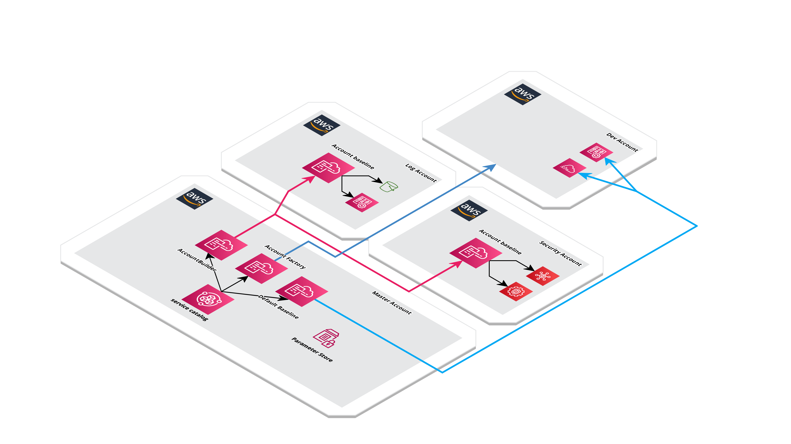

# Automated Landing Zone

Creates a base landing zone with logging account , security account and a dev account
###### Accounts are created via Lambda function from cloudformation 

#### Prereq

1. AWS Account with organization enabled

2. and Trusted Access Enabled in AWS Cloudformation Stackset 

#### How to Setup

1. Deploy the initialsetup.yaml in cloudformation, which will create a service catalog.
    
   ###### Service Catalog contains 5 products and a Portfolio to contain.
      a) DefaultBaseline Product
      b) Security Account Build Product
      c) Log Account Build Product
      d) Dev Account Build Product
      e) Account Factory Product (For Future New Accounts)

2. After Initial setup, launch a log account product 
3. After Log Account Product, launch Security account product
4. After Security launch Dev Account product
5. Atlast launch Default baseline product

### Note 

Initially log and security account have a initial baseline which launches s3 bucket in log account, guardduty and Adminrole and readonly role in security account.
And there is Default Account Baseline which is common for all accounts and it is deployed via stacksets to accounts in organization.

Make sure before initial setup upload all the files in your aws s3 bucket in the exact same order. Thank you

 
